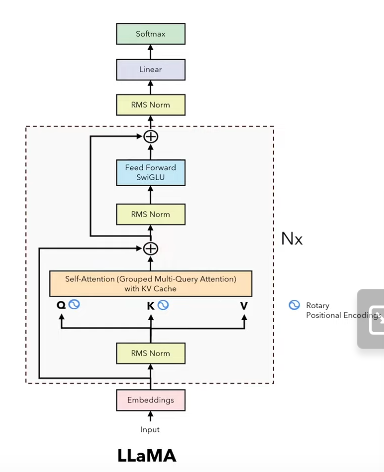
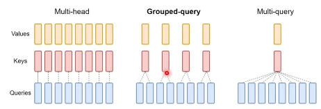

# LLaMA Architecture

  

## RMS Norm 

Instead of normal layer normalization that uses mean and variance to modify the distribution, In RMS Norm they claim that mean does not play a role in improving the model and it is just the variance that helps and they found a statistic that is devoid of mean which is RMS. Here gamma is a learnable parameter. 

  

## Rotary Positional Encoding 

They replace absolute positional encoding with RoPE embeddings to decrease the attention between two tokens if they are far apart. They do it by finding method to include the relative distance with the dot product of query and key while calculating attention values. 

  

  

  

## Grouped Multi Query Attention

GPUs are fast in computing but are comparitively slow in transfer of memory. In regular multihead attention the ratio of computation to memory transfer is very low and it didnt affect the overall time taken but after applying KV Caching this significantly increased the ration thus increasing the time for computation. In order to prevent this we split only the query into n heads instead of keys and values (Multi Query Attention) thus significantly reducing the ratio. In Grouped Mult Query Attention we divide the keys and values in lesser groups than dividing than the number of heads the query is divided into providing significant balance between time and quality.

  

## SwiGLU Activation

  

They use SwiGLU activation function by observing performance through experimentation.

