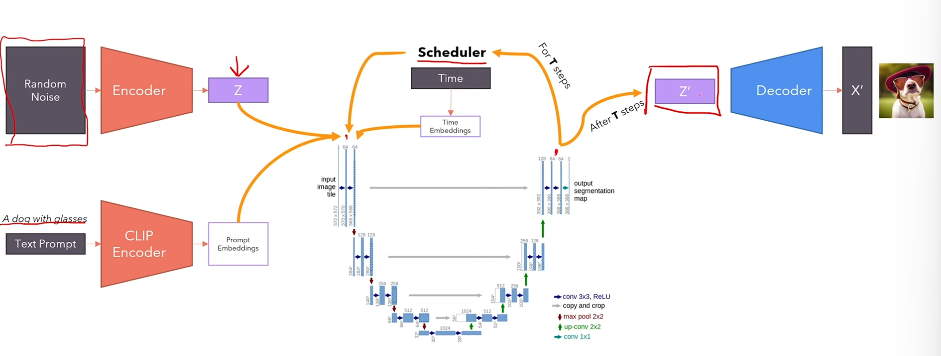

# Stable Diffusion

## Introduction
Stable Diffusion was introduced to improve normal diffusion models by introducing Variational Autoencoders (VAE) into the pipeline there by creating a latent space which prevented the usage of large input dimensions.

## VAE
Stable Diffusion model has a VAE built in to reduce the dimensions of the image by projecting it into a latent space. The VAE his made up of several convolutional, residual and attention blocks. It takes in a noisy image as input if its text-to-image task or an actual image as input if its image-to-image task.

## CLIP Text Encoder
CLIP model is used to add textual conditioning to the image generation by stable diffusion. It takes in a text prompt and returns a embedding which is then passed on to the diffusion model (U-Net) for image conditioning.

## U-Net
U-Net is used as the diffusion model which takes in the noisy latent as input from the VAE, text embedding from CLIP and time embedding from the scheduler to remove the noise step by step by passing the latent multiple defined timesteps. The time embeddings, text embeddings and the latent is combined to one using cross-attention.

## DDPM Sampling
DDPM (Denoising Diffusion Probablistic Models) is the sampler that is used in this stable diffusion implementation. Diffusion models mainly have two main processes: forward and reverse. The forward process is a gaussian transition and is predefined from sampler to sampler. The reverse process is what which is approximated by the diffusion model which is U-Net in this case. The reverse process is also a gaussian transition. 

